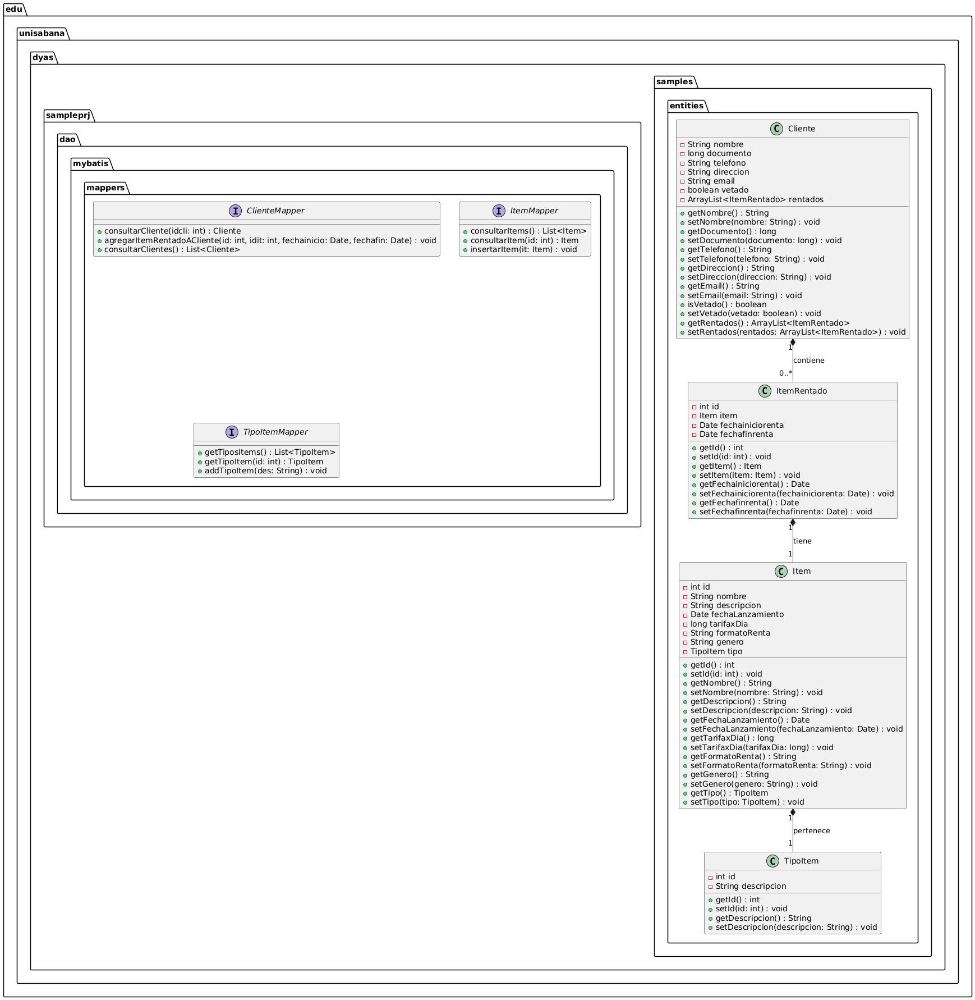

# Taller 4: Tecnologías de persistencia - Frameworks de Persistencia - Introducción a MyBatis

## Universidad de la Sabana - Diseño y Arquitectura de Software

### Integración de MyBatis para la gestión de datos y relaciones entre clases

## Descripción del Proyecto

Este proyecto implementa el uso de **MyBatis**, un framework de persistencia en Java, para gestionar consultas y mapeos de objetos a bases de datos. El sistema está diseñado para manejar operaciones CRUD entre las entidades `Cliente`, `Item`, `ItemRentado` y `TipoItem` y su relación a través de múltiples mappers. A través de estas relaciones, MyBatis facilitará la interacción con la base de datos de manera eficiente.

## Requisitos del Proyecto

El sistema debe:

- Utilizar **MyBatis** para manejar las consultas y el mapeo de objetos a las tablas de la base de datos.
- Incluir las entidades `Cliente`, `Item`, `ItemRentado` y `TipoItem`, con sus respectivas relaciones entre ellas.
- Realizar operaciones de inserción y consulta de datos mediante el uso de mappers en MyBatis.
- Implementar consultas eficientes con relaciones de uno a muchos (entre `Cliente` y `ItemRentado`) y de muchos a uno (entre `Item` y `TipoItem`).

## Implementación

### Mapeo con MyBatis

En este proyecto, MyBatis se utiliza para gestionar la conversión de los resultados de las consultas SQL a objetos Java y viceversa. Se definen múltiples `resultMap` para mapear las propiedades de las clases Java a las columnas de la base de datos y para manejar las relaciones entre las entidades.

#### Principales Operaciones:
1. **Consultar Clientes**: Se puede consultar todos los clientes y sus items rentados asociados a través de una consulta con múltiples joins.
2. **Insertar Item**: El sistema permite insertar un nuevo ítem, asociándolo a un `TipoItem`.
3. **Consultar Ítems**: Se pueden consultar ítems por su id o obtener todos los ítems disponibles.

### Estructura del Proyecto

#### Clases:

- **Cliente**: Representa a un cliente con atributos como `nombre`, `documento`, `telefono`, etc., y tiene una lista de `ItemRentado` asociados.
- **Item**: Representa un ítem disponible para renta con atributos como `nombre`, `descripcion`, `tarifaxDia`, etc.
- **ItemRentado**: Representa un ítem rentado por un cliente, incluyendo las fechas de inicio y fin de la renta.
- **TipoItem**: Representa el tipo de un ítem (por ejemplo, "Electrónico", "Mueble").

#### Mappers:

- **ClienteMapper**: Define las operaciones de consulta e inserción para los objetos `Cliente` y sus relaciones con `ItemRentado`.
- **ItemMapper**: Define las operaciones de consulta e inserción para los objetos `Item` y su relación con `TipoItem`.
- **TipoItemMapper**: Define las operaciones para manejar los objetos `TipoItem`.

## Lógica del Proyecto

El proyecto permite:

- Consultar todos los clientes junto con sus `ItemRentado` asociados.
- Consultar un ítem por su id y asociarlo con su tipo (`TipoItem`).
- Insertar nuevos ítems en la base de datos, con su respectivo tipo (`TipoItem`).

## Ejemplo de Uso

1. **Consultar Clientes**: Usando el `ClienteMapper`, puedes obtener todos los clientes con sus ítems rentados asociados.
2. **Insertar un Ítem**: Usando el `ItemMapper`, puedes insertar un nuevo ítem en la base de datos, asignándole un tipo (`TipoItem`).
3. **Consultar Ítems**: Usando el `ItemMapper`, puedes consultar los detalles de un ítem por su id.

### Diagrama UML

A continuación se muestra el diagrama UML del sistema:



## Ejecución del Programa

- Se establece una conexión con la base de datos.
- Se realizan consultas para obtener los clientes y sus ítems rentados.
- Se insertan nuevos ítems y se muestran los resultados de las consultas.

### Salida Esperada

La salida esperada del programa es la siguiente:

```plaintext
Insertando el siguiente Item:
Item{id=0, nombre='Nuevo Item', descripcion='Descripción del nuevo item', fechaLanzamiento=Sun Mar 09 20:08:15 GMT-05:00 2025, tarifaxDia=5000, formatoRenta='Diario', genero='Electrónica', tipo=TipoItem{id=1, descripcion='Electrónico'}}
Item insertado correctamente.
ID generado para el nuevo item: 5
Item recuperado desde la base de datos:
Item{id=5, nombre='Nuevo Item', descripcion='Descripción del nuevo item', fechaLanzamiento=Sun Mar 09 20:08:15 GMT-05:00 2025, tarifaxDia=5000, formatoRenta='Diario', genero='Electrónica', tipo=TipoItem{id=1, descripcion='Electrónico'}}
```
### Autor
**Andrés Azcona**  
Estudiante de Ingeniería Informática  
**Universidad de La Sabana**
